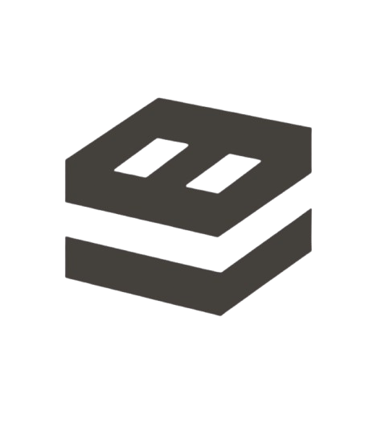

<!-- Improved compatibility of back to top link: See: https://github.com/othneildrew/Best-README-Template/pull/73 -->

<a id="readme-top"></a>

<!--
*** Thanks for checking out the Best-README-Template. If you have a suggestion
*** that would make this better, please fork the repo and create a pull request
*** or simply open an issue with the tag "enhancement".
*** Don't forget to give the project a star!
*** Thanks again! Now go create something AMAZING! :D
-->

<!-- PROJECT SHIELDS -->
<!--
*** I'm using markdown "reference style" links for readability.
*** Reference links are enclosed in brackets [ ] instead of parentheses ( ).
*** See the bottom of this document for the declaration of the reference variables
*** for contributors-url, forks-url, etc. This is an optional, concise syntax you may use.
*** https://www.markdownguide.org/basic-syntax/#reference-style-links
-->

[![Contributors][contributors-shield]][contributors-url]
[![Forks][forks-shield]][forks-url]
[![Stargazers][stars-shield]][stars-url]
[![Issues][issues-shield]][issues-url]
[![MIT License][license-shield]][license-url]
[![LinkedIn][linkedin-shield]][linkedin-url]

<!-- PROJECT LOGO -->
<br />
<div align="center">
  <a href="https://github.com/Snorlark/larkbabao-portfolio">
    
  </a>

  <h5 align="center">Lark Babao Portfolio</h3>

  <p align="center">
    A modern, interactive portfolio showcasing full-stack development projects and professional journey
    <br />
    <a href="https://snorlark.github.io/larkbabao-portfolio/"><strong>View Live Demo »</strong></a>
    <br />
    <br />
    <a href="https://snorlark.github.io/larkbabao-portfolio/">Live Demo</a>
    &middot;
    <a href="https://github.com/Snorlark/larkbabao-portfolio/issues">Report Bug</a>
    &middot;
    <a href="https://github.com/Snorlark/larkbabao-portfolio/issues">Request Feature</a>
  </p>
</div>

<!-- TABLE OF CONTENTS -->
<details>
  <summary>Table of Contents</summary>
  <ol>
    <li>
      <a href="#about-the-project">About The Project</a>
      <ul>
        <li><a href="#built-with">Built With</a></li>
      </ul>
    </li>
    <li>
      <a href="#getting-started">Getting Started</a>
      <ul>
        <li><a href="#prerequisites">Prerequisites</a></li>
        <li><a href="#installation">Installation</a></li>
      </ul>
    </li>
    <li><a href="#features">Features</a></li>
    <li><a href="#project-showcase">Project Showcase</a></li>
    <li><a href="#roadmap">Roadmap</a></li>
    <li><a href="#contributing">Contributing</a></li>
    <li><a href="#license">License</a></li>
    <li><a href="#contact">Contact</a></li>
    <li><a href="#acknowledgments">Acknowledgments</a></li>
  </ol>
</details>

<!-- ABOUT THE PROJECT -->

## About The Project

[![Portfolio Screenshot][product-screenshot]](https://snorlark.github.io/larkbabao-portfolio/)

This is my personal portfolio website that showcases my journey as a full-stack developer, featuring interactive animations, responsive design, and a comprehensive display of my projects and achievements. The portfolio demonstrates my expertise in modern web technologies and my passion for creating seamless user experiences.

Here's what makes this portfolio special:

- **Interactive Animations**: Smooth GSAP-powered animations and scroll-triggered effects
- **Responsive Design**: Mobile-first approach with Tailwind CSS
- **Modern Tech Stack**: Built with React, TypeScript, and Vite for optimal performance
- **Project Showcase**: Detailed display of 9+ projects across web, mobile, and desktop platforms
- **Professional Journey**: Timeline showcasing my development path and achievements
- **Contact Integration**: Direct links to social media and professional networks

The portfolio serves as both a demonstration of my technical skills and a gateway for potential collaborators and employers to understand my capabilities and experience.

<p align="right">(<a href="#readme-top">back to top</a>)</p>

### Built With

This portfolio is built using modern web technologies and frameworks:

- [![React][React.js]][React-url]
- [![TypeScript][TypeScript]][TypeScript-url]
- [![Vite][Vite]][Vite-url]
- [![Tailwind CSS][TailwindCSS]][TailwindCSS-url]
- [![GSAP][GSAP]][GSAP-url]
- [![Motion][Motion]][Motion-url]
- [![Lucide React][LucideReact]][LucideReact-url]

<p align="right">(<a href="#readme-top">back to top</a>)</p>

<!-- GETTING STARTED -->

## Getting Started

To get a local copy up and running follow these simple example steps.

### Prerequisites

This is an example of how to list things you need to use the software and how to install them.

- npm
  ```sh
  npm install npm@latest -g
  ```

### Installation

1. Clone the repo
   ```sh
   git clone https://github.com/Snorlark/larkbabao-portfolio.git
   ```
2. Install NPM packages
   ```sh
   npm install
   ```
3. Start the development server
   ```sh
   npm run dev
   ```
4. Build for production
   ```sh
   npm run build
   ```
5. Preview production build
   ```sh
   npm run preview
   ```

<p align="right">(<a href="#readme-top">back to top</a>)</p>

<!-- FEATURES -->

## Features

### 🎨 **Interactive Design**

- Smooth scroll-triggered animations using GSAP
- Blur text effects and fade-in content animations
- Responsive image trails and tilted card components
- Logo loop animations with hover effects

### 📱 **Responsive Layout**

- Mobile-first design approach
- Adaptive navigation with active section highlighting
- Flexible grid layouts for different screen sizes
- Touch-friendly interactions

### 🚀 **Performance Optimized**

- Vite for fast development and building
- TypeScript for type safety and better development experience
- Optimized images and lazy loading
- Modern CSS with Tailwind for efficient styling

### 📊 **Project Showcase**

- 9+ featured projects across multiple platforms
- Detailed project descriptions and technology stacks
- Live demo and GitHub repository links
- Project categorization (Web, Mobile, Desktop, UI Designs)

### 🎯 **Professional Journey**

- Interactive timeline of career milestones
- Achievement statistics with animated counters
- Leadership experience at GDSC NU Manila
- Educational background and certifications

<p align="right">(<a href="#readme-top">back to top</a>)</p>

<!-- PROJECT SHOWCASE -->

## Project Showcase

### Featured Projects

#### 🌾 **Maize Watch Dashboard**

- **Type**: Web Application
- **Description**: IoT-powered monitoring and analytics dashboard for corn farmers
- **Tech Stack**: React, Node.js, MongoDB, Firebase, Tailwind CSS
- **Live Demo**: [maize-watch.com](https://maize-watch.com)
- **GitHub**: [Maize-Watch Repository](https://github.com/Snorlark/Maize-Watch)

#### 📱 **Maize Watch Mobile**

- **Type**: Mobile Application
- **Description**: Real-time IoT monitoring app for agricultural data collection
- **Tech Stack**: Flutter, Firebase, Node.js
- **GitHub**: [Maize-Watch Repository](https://github.com/Snorlark/Maize-Watch)

#### 🏝️ **Palawan Tour Website**

- **Type**: Tourism Website
- **Description**: Responsive tourism website showcasing Palawan's destinations
- **Tech Stack**: HTML, CSS, JavaScript
- **Live Demo**: [Palawan Tour](https://snorlark.github.io/Palawan-Tour/index.html)
- **GitHub**: [Palawan-Tour Repository](https://github.com/Snorlark/Palawan-Tour)

#### 🎉 **Sinagtala Event Management**

- **Type**: Event Management Web App
- **Description**: Interactive event planning and participant tracking system
- **Tech Stack**: HTML, CSS, JavaScript
- **Live Demo**: [Sinagtala Event](https://snorlark.github.io/Sinagtala-Event-Management/)
- **GitHub**: [Sinagtala Repository](https://github.com/Snorlark/Sinagtala-Event-Management)

#### 🎮 **Touch My Deck**

- **Type**: Android Game
- **Description**: Logic-based card-sorting game with Firebase integration
- **Tech Stack**: Android Studio, Firebase
- **GitHub**: [TouchMyDeck Repository](https://github.com/Snorlark/TouchMyDeck)

#### 🤖 **FiloDroids**

- **Type**: Desktop Application
- **Description**: Filipino robot avatar customization app
- **Tech Stack**: JavaFX, SceneBuilder
- **GitHub**: [FiloDroids Repository](https://github.com/Snorlark/FiloDroids)

<p align="right">(<a href="#readme-top">back to top</a>)</p>

<!-- ROADMAP -->

## Roadmap

- [x] Complete portfolio website with modern design
- [x] Implement interactive animations and effects
- [x] Add project showcase with detailed descriptions
- [x] Create responsive mobile-first design
- [x] Integrate contact form and social links
- [ ] Add blog section for technical articles
- [ ] Implement dark/light theme toggle
- [ ] Add project filtering and search functionality
- [ ] Create downloadable resume feature
- [ ] Add testimonials section
- [ ] Implement analytics tracking
- [ ] Add multi-language support (English/Filipino)

See the [open issues](https://github.com/Snorlark/larkbabao-portfolio/issues) for a full list of proposed features (and known issues).

<p align="right">(<a href="#readme-top">back to top</a>)</p>

<!-- CONTRIBUTING -->

## Contributing

Contributions are what make the open source community such an amazing place to learn, inspire, and create. Any contributions you make are **greatly appreciated**.

If you have a suggestion that would make this better, please fork the repo and create a pull request. You can also simply open an issue with the tag "enhancement".
Don't forget to give the project a star! Thanks again!

1. Fork the Project
2. Create your Feature Branch (`git checkout -b feature/AmazingFeature`)
3. Commit your Changes (`git commit -m 'Add some AmazingFeature'`)
4. Push to the Branch (`git push origin feature/AmazingFeature`)
5. Open a Pull Request

### Top contributors:

<a href="https://github.com/Snorlark/larkbabao-portfolio/graphs/contributors">
  
</a>

<p align="right">(<a href="#readme-top">back to top</a>)</p>

<!-- LICENSE -->

## License

Distributed under the MIT License. See `LICENSE.txt` for more information.

<p align="right">(<a href="#readme-top">back to top</a>)</p>

<!-- CONTACT -->

## Contact

**Lark Sigmuond Babao** - [@larksigmuondbabao](https://www.facebook.com/larksigmuondbabao/) - larksigmuondbabao@gmail.com

Project Link: [https://github.com/Snorlark/larkbabao-portfolio](https://github.com/Snorlark/larkbabao-portfolio)

**Social Media:**

- [LinkedIn](https://www.linkedin.com/in/lark-sigmuond-babao-9a8a012b2/)
- [GitHub](https://github.com/Snorlark)
- [Facebook](https://www.facebook.com/larksigmuondbabao/)

**Resume:** [Download CV](https://babao-lark-resume.tiiny.site/)

<p align="right">(<a href="#readme-top">back to top</a>)</p>

<!-- ACKNOWLEDGMENTS -->

## Acknowledgments

Use this space to list resources you find helpful and would like to give credit to. I've included a few of my favorites to kick things off!

- [React Bits](https://reactbits.dev) - UI Components inspiration
- [GSAP](https://greensock.com/gsap/) - Animation library
- [Tailwind CSS](https://tailwindcss.com/) - Utility-first CSS framework
- [Lucide React](https://lucide.dev/) - Beautiful & consistent icon toolkit
- [Vite](https://vitejs.dev/) - Next generation frontend tooling
- [TypeScript](https://www.typescriptlang.org/) - Typed JavaScript at any scale
- [GitHub Pages](https://pages.github.com/) - Static site hosting
- [Figma](https://figma.com/) - Design and prototyping tool

<p align="right">(<a href="#readme-top">back to top</a>)</p>

<!-- MARKDOWN LINKS & IMAGES -->
<!-- https://www.markdownguide.org/basic-syntax/#reference-style-links -->

[contributors-shield]: https://img.shields.io/github/contributors/Snorlark/larkbabao-portfolio.svg?style=for-the-badge
[contributors-url]: https://github.com/Snorlark/larkbabao-portfolio/graphs/contributors
[forks-shield]: https://img.shields.io/github/forks/Snorlark/larkbabao-portfolio.svg?style=for-the-badge
[forks-url]: https://github.com/Snorlark/larkbabao-portfolio/network/members
[stars-shield]: https://img.shields.io/github/stars/Snorlark/larkbabao-portfolio.svg?style=for-the-badge
[stars-url]: https://github.com/Snorlark/larkbabao-portfolio/stargazers
[issues-shield]: https://img.shields.io/github/issues/Snorlark/larkbabao-portfolio.svg?style=for-the-badge
[issues-url]: https://github.com/Snorlark/larkbabao-portfolio/issues
[license-shield]: https://img.shields.io/github/license/Snorlark/larkbabao-portfolio.svg?style=for-the-badge
[license-url]: https://github.com/Snorlark/larkbabao-portfolio/blob/master/LICENSE.txt
[linkedin-shield]: https://img.shields.io/badge/-LinkedIn-black.svg?style=for-the-badge&logo=linkedin&colorB=555
[linkedin-url]: https://www.linkedin.com/in/lark-sigmuond-babao-9a8a012b2/
[product-screenshot]: portfolio-screenshot.png
[React.js]: https://img.shields.io/badge/React-20232A?style=for-the-badge&logo=react&logoColor=61DAFB
[React-url]: https://reactjs.org/
[TypeScript]: https://img.shields.io/badge/TypeScript-007ACC?style=for-the-badge&logo=typescript&logoColor=white
[TypeScript-url]: https://www.typescriptlang.org/
[Vite]: https://img.shields.io/badge/Vite-646CFF?style=for-the-badge&logo=vite&logoColor=white
[Vite-url]: https://vitejs.dev/
[TailwindCSS]: https://img.shields.io/badge/Tailwind_CSS-38B2AC?style=for-the-badge&logo=tailwind-css&logoColor=white
[TailwindCSS-url]: https://tailwindcss.com/
[GSAP]: https://img.shields.io/badge/GSAP-88CE02?style=for-the-badge&logo=greensock&logoColor=white
[GSAP-url]: https://greensock.com/gsap/
[Motion]: https://img.shields.io/badge/Motion-000000?style=for-the-badge&logo=motion&logoColor=white
[Motion-url]: https://motion.dev/
[LucideReact]: https://img.shields.io/badge/Lucide-000000?style=for-the-badge&logo=lucide&logoColor=white
[LucideReact-url]: https://lucide.dev/
